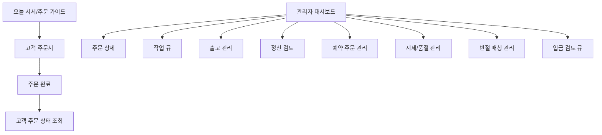

# 화면 와이어프레임

## 1. 문서 목적

이 문서는 고객용 화면과 관리자용 화면의 레이아웃과 핵심 UI 요소를 텍스트 와이어프레임 형태로 정리한다.  
목표는 디자인 감각을 결정하는 것이 아니라, 개발과 화면 설계가 바로 시작될 수 있게 구조를 고정하는 것이다.

## 2. 화면 맵



## 3. 고객용 화면

### 3-1. 오늘 시세/주문 가이드

목적:

- 오픈카톡 공지성 정보를 웹 화면으로 구조화
- 고객이 주문 가능 여부를 스스로 판단

와이어프레임:

```text
+--------------------------------------------------+
| [매장명] 오늘바다 데모점                          |
| 오늘 시세와 주문 안내를 확인하고 바로 주문하세요 |
+--------------------------------------------------+
| 영업시간 | 주소 | 문의번호 | 계좌정보            |
+--------------------------------------------------+
| [공지 배너]                                     |
| - 당일택배는 평일 오전 9:30 전 주문             |
| - 카카오퀵은 2~3시간 전 주문 권장               |
+--------------------------------------------------+
| [오늘 시세표]                                   |
| 품목 | 규격 | 단가 | 상태 | 예약가능            |
| 광어 | 3kg  | 30000 | 주문가능 | O             |
| 시마 | 2kg  | 40000 | 완판 | X                 |
+--------------------------------------------------+
| [주문 가이드]                                   |
| 직접 픽업 / 퀵 / 일반택배 / 당일택배 / 고속택배 |
| 회는 퀵 권장, 일반택배는 오로시 권장            |
+--------------------------------------------------+
| [주문하러 가기]                                 |
+--------------------------------------------------+
```

### 3-2. 고객 주문서

목적:

- 주문 정보를 표준화된 형식으로 수집

와이어프레임:

```text
+--------------------------------------------------+
| [주문자 정보]                                   |
| 주문자명 [      ] 연락처 [      ]               |
| 입금자명 [      ]                                |
+--------------------------------------------------+
| [주문 내용]                                     |
| 품목 [드롭다운/직접입력]                         |
| 규격 [      ] 수량 [      ]                     |
| 구매단위 ( ) 전체  ( ) 반절 희망               |
| 손질방식 [원물/오로시/회/기타]                 |
| 진공포장 ( ) 요청                               |
| 요청사항 [                           ]          |
+--------------------------------------------------+
| [수령 정보]                                     |
| 수령방식 ( ) 픽업 ( ) 퀵 ( ) 택배             |
| 날짜 [      ] 시간 [      ]                     |
| 수령인명 [      ] 연락처 [      ]               |
| 주소 [                           ]              |
| 공동현관 비밀번호 [      ]                      |
+--------------------------------------------------+
| [안내]                                          |
| - 최종 금액은 손질비/운임비 포함 후 안내 가능   |
| - 일반택배는 회보다 오로시 권장                 |
+--------------------------------------------------+
| [주문 접수하기]                                 |
+--------------------------------------------------+
```

### 3-3. 주문 완료 화면

목적:

- 고객이 주문 접수와 다음 단계를 이해

와이어프레임:

```text
+--------------------------------------------------+
| 주문이 접수되었습니다                            |
| 주문번호: OB-20260403-001                        |
+--------------------------------------------------+
| 현재상태: 최종 금액 확정 대기                    |
| 수령방식: 당일택배                               |
| 다음안내: 최종 금액 확정 후 입금 안내 예정       |
+--------------------------------------------------+
| [문의하기] [주문상태 조회]                       |
+--------------------------------------------------+
```

### 3-4. 고객 주문 상태 조회

목적:

- 고객이 전화 없이 주문 진행 상태 확인

핵심 요소:

- 주문번호
- 최종 금액 확정 여부
- 입금 확인 여부
- 손질 상태
- 출고 상태
- 송장번호 또는 퀵 안내

## 4. 관리자용 핵심 화면

### 4-1. 관리자 대시보드

목적:

- 사장님이 첫 화면에서 막힌 주문을 즉시 파악

와이어프레임:

```text
+----------------------------------------------------------------+
| 오늘 신규 | 금액확정대기 | 미입금 | 손질대기 | 출고대기        |
|    12     |      3       |   4    |    5     |    6            |
+----------------------------------------------------------------+
| [필터] 오늘주문 / 예약 / 미입금 / 픽업 / 퀵 / 택배 / 매칭대기 |
| [검색] 주문번호 / 이름 / 연락처                                |
+----------------------------------------------------------------+
| 주문번호 | 주문자 | 품목요약 | 금액상태 | 입금상태 | 출고상태   |
| OB-001   | 홍길동 | 광어 1건 | 확정전   | 미입금   | -          |
| OB-002   | 김철수 | 숭어 1건 | 확정완료 | 입금완료 | 픽업대기   |
+----------------------------------------------------------------+
```

### 4-2. 주문 상세

목적:

- 주문 1건의 전체 운영을 끝까지 처리

와이어프레임:

```text
+--------------------------------------------------------------+
| 주문번호 OB-001   [현재상태: pricing_pending]                |
| 주문자 홍길동 / 010-xxxx-xxxx / 수령방식 택배               |
+--------------------------------------------------------------+
| [주문 내용]                                                  |
| 광어 / 3kg / 반절희망 / 오로시 / 진공포장                    |
+--------------------------------------------------------------+
| [정산]                                                       |
| 원물금액 54000                                               |
| 손질비 4000                                                  |
| 운임비 7000                                                  |
| 최종금액 65000                                               |
| [최종 금액 저장] [입금 요청 상태로 변경]                     |
+--------------------------------------------------------------+
| [입금]                                                       |
| 입금자명 / 상태 / 거래 연결 / [수동확인] [검토필요]          |
+--------------------------------------------------------------+
| [출고]                                                       |
| 주소 / 수령인 / 택배유형 / 송장번호                          |
| [송장 저장] [발송 완료]                                      |
+--------------------------------------------------------------+
| [메모/로그]                                                  |
| 고객 요청 / 내부 메모 / 상태변경 이력                        |
+--------------------------------------------------------------+
```

### 4-3. 작업 큐

목적:

- 직원이 지금 손질해야 할 순서를 빠르게 파악

와이어프레임:

```text
+--------------------------------------------------------------+
| 작업 큐 - 손질 대기                                          |
+--------------------------------------------------------------+
| 14:00 픽업 | 홍길동 | 광어 3kg | 회손질 | 입금완료          |
| [손질 시작]                                                  |
+--------------------------------------------------------------+
| 15:30 퀵    | 김철수 | 숭어 1.3kg | 오로시 | 입금완료        |
| [손질 시작]                                                  |
+--------------------------------------------------------------+
```

### 4-4. 출고 관리

목적:

- 포장 완료 후 픽업/퀵/택배를 방식별로 정리

와이어프레임:

```text
+--------------------------------------------------------------+
| [탭] 직접 픽업 | 퀵 | 택배                                   |
+--------------------------------------------------------------+
| 주문자 | 수령방식 | 주소/픽업시간 | 입금상태 | 액션          |
| 홍길동 | 택배     | 서울 ...      | 완료     | 송장입력      |
| 김철수 | 퀵       | 영등포 ...    | 완료     | 인계완료      |
| 박영희 | 픽업     | 16:30 방문    | 완료     | 픽업완료      |
+--------------------------------------------------------------+
```

### 4-5. 정산 검토 화면

목적:

- 최종 금액 미확정 주문과 미입금 출고 위험 주문을 모아봄

와이어프레임:

```text
+----------------------------------------------------------------+
| 정산 검토                                                      |
+----------------------------------------------------------------+
| 주문번호 | 품목 | 손질비 | 운임비 | 금액상태 | 입금상태 | 액션 |
| OB-001   | 광어 | 4000   | 7000   | 확정전   | 미입금   | 입력 |
| OB-010   | 연어 | 2000   | 5000   | 확정완료 | 미입금   | 경고 |
+----------------------------------------------------------------+
```

### 4-6. 시세/품절 관리 화면

목적:

- 오픈카톡 공지성 시세 정보를 관리자 화면에서 편집

핵심 요소:

- 날짜 선택
- 품목 목록
- 단가 입력
- 품절/완판 토글
- 예약 가능 여부
- 게시 버튼

### 4-7. 예약 주문 관리 화면

목적:

- 오늘 주문과 내일 이후 예약 주문을 분리

핵심 요소:

- 예약일 기준 필터
- 품목명
- 요청 날짜/시간
- 경매 확보 요청 메모
- 예약 확정 여부

### 4-8. 반절 매칭 관리 화면

목적:

- 반절 주문을 안전하게 수동 매칭

와이어프레임:

```text
+--------------------------------------------------------------+
| 반절 매칭 관리                                               |
+--------------------------------------------------------------+
| 주문 A: 광어 3kg / 픽업 / 15:00 / 오로시                    |
| 주문 B: 광어 3kg / 픽업 / 15:30 / 오로시                    |
| 적합도 88점                                                  |
| 경고 없음                                                    |
| [매칭 확정] [보류] [실패처리]                               |
+--------------------------------------------------------------+
```

### 4-9. 입금 검토 큐

목적:

- 자동 대조가 애매한 입금만 따로 처리

핵심 요소:

- 주문번호
- 기대 금액
- 실제 거래 금액
- 입금자명
- 후보 점수
- 수동 승인/반려 버튼

## 5. 모바일 우선 포인트

- 대시보드 카드에서 `금액확정대기`, `미입금`, `출고대기`가 바로 보여야 함
- 주문 상세에서 전화번호, 주소, 송장 입력, 상태 버튼이 손쉽게 눌려야 함
- 퀵/택배 주문은 주소와 메모가 접히지 않아야 함
- 긴 표보다 카드형 리스트가 적합함

## 6. 화면 구현 우선순위

### P0

- 오늘 시세/주문 가이드
- 고객 주문서
- 주문 완료
- 관리자 대시보드
- 주문 상세
- 작업 큐
- 출고 관리
- 정산 검토

### P1

- 시세/품절 관리
- 예약 주문 관리
- 반절 매칭 관리
- 입금 검토 큐

### P2

- 고객 상태 조회 고도화
- 자동 입금 로그 화면
- 공지 생성 보조 화면
